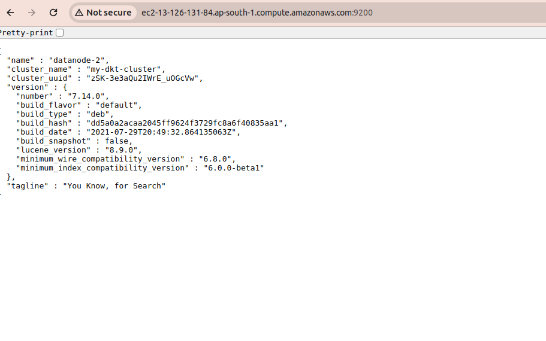
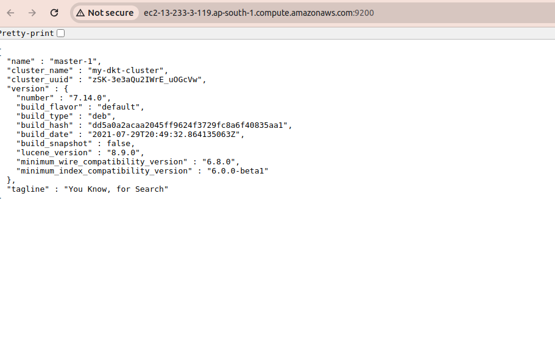
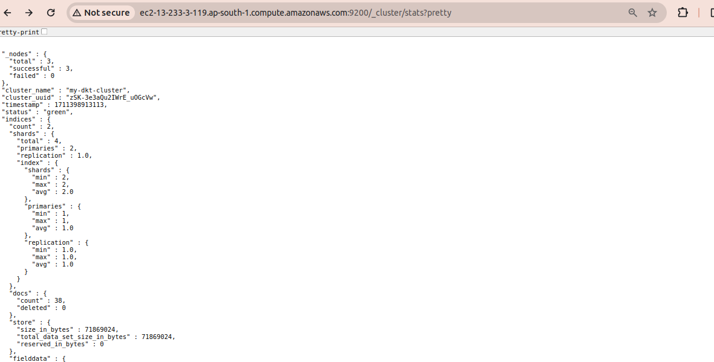
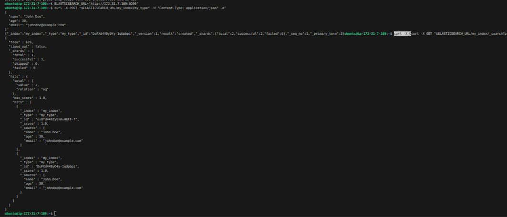
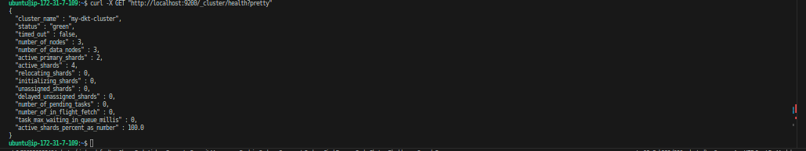

# dkatalis
DevOps assignment for Dkatalis

# Pre-Requisites

- JDK-11 particularly, as there is compatibility issue with other version which I tried 
- Ubuntu AMI 
- Terraform

# Steps

- terraform init 
- terraform plan 
- terraform apply  -auto-approve=true (This will create the AWS resources, make sure you are in the root location of the repo)

# Achievement 

- AWS Instances are created and running successfully using Terraform code
- Elasticsearch installed successfully 
- Setup for 3 nodes 1 Master, 2 Data-nodes configured
- ALB created, Listener, Health Check added.  
- Put request done 

# Q&A 

1. What did you choose to automate the provisioning and bootstrapping of the instance? Why?
- Used Terraform for resource creation because it provides a declarative way to create infrastructure  resources on cloud platforms AWS

2. How did you choose to secure ElasticSearch? Why?
- For dashboard security have enable the native bootstarp password authentication from elasticsearch.yml
we can enable  it by setting `xpack.security.enabled: true` in elasticsearch.yml file. This will make sure that only authenticated users file. This will allow access to Kibana file. This will allow only authenticated users

3. How would you monitor this instance? What metrics would you monitor?
- CPU & Memory would be basics to start , json metrics can be measured 

4. Could you extend your solution to launch a secure cluster of ElasticSearch nodes? What
would need to change to support this use case?
- I have created a 3 node cluster, Have created an ASG & Launch Config in AWS to manage the node capacity & to scale the cluster it will needed an Domain name, creaion of ALB & manaiging DNS &b adding SSL certs using openSSL which is possible to access is over https.

5. Could you extend your solution to replace a running ElasticSearch instance with little or no
downtime? How?
- For extending it may have downtime of around 10 min to re-initialise all the configs 

6. Was it a priority to make your code well structured, extensible, and reusable?
-  Yes, have kept modular approach 

7. What sacrifices did you make due to time?
- Didn't applied SSL/TLS for encrypted communication & was not able to register the targets to ALB
- we can use AWS ACM / we can go with SSL creation using  self signed certificates but that needs manual intervention by using OpenSLL

